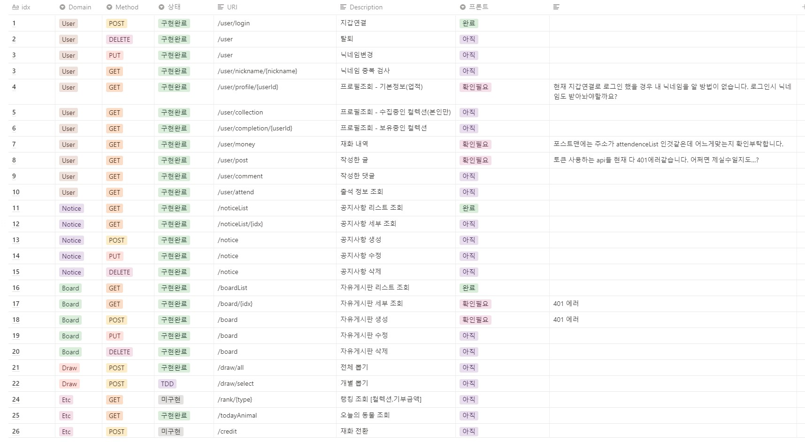
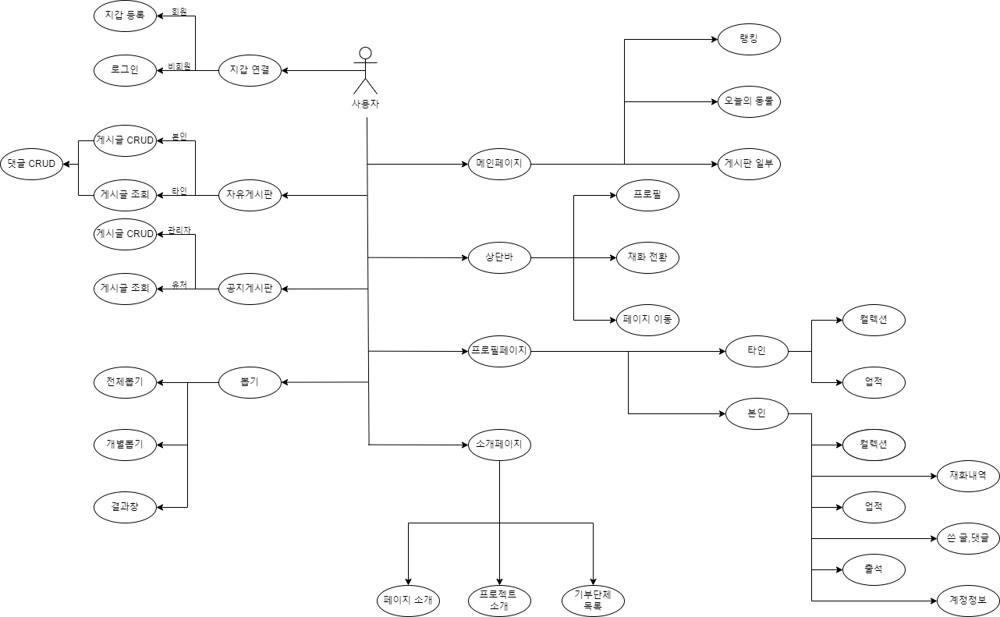
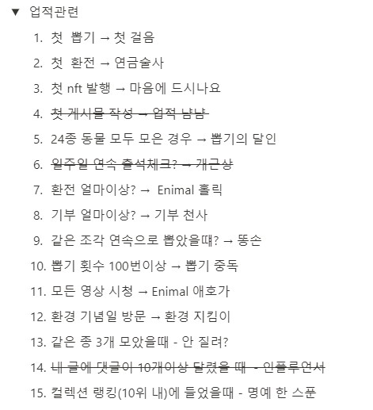

# 산출물

 

> **:anchor: 항목 바로가기** 
>
>  [와이어프레임](#와이어프레임)  / [요구사항 명세서](#요구사항-명세서) / [API 명세서](#API-명세서) / [useCase](#useCase) / [ERD TABLE](#ERD-TABLE) / [업적](#업적)
>
> 
>
>  :bulb: 각 항목의 '자세히 보기'를 클릭하시면 피그마/노션에서 결과물 원본을 보실 수 있습니다

  

## 와이어프레임

[자세히 보기](https://www.figma.com/file/1DAfzAuFRHALsh26uvBEQM/Enimal?node-id=0%3A1)

---

 

 

##  요구사항 명세서

[자세히 보기](https://www.notion.so/5d15d6756c8e403d99c678029aae486b)

---

 

 

## API 명세서

[자세히 보기](https://www.notion.so/API-34f75d27e1f5472083b64a4d0953c459)

---

 

 

## useCase

[자세히 보기](https://www.notion.so/ERD-useCase-69e6c52a95c4440ab46a93880c2a4c62)

---

 

 

##  ERD TABLE

[자세히 보기](https://www.notion.so/ERD-useCase-69e6c52a95c4440ab46a93880c2a4c62)

---

 

 

## 업적

[자세히보기](https://www.notion.so/API-34f75d27e1f5472083b64a4d0953c459)

